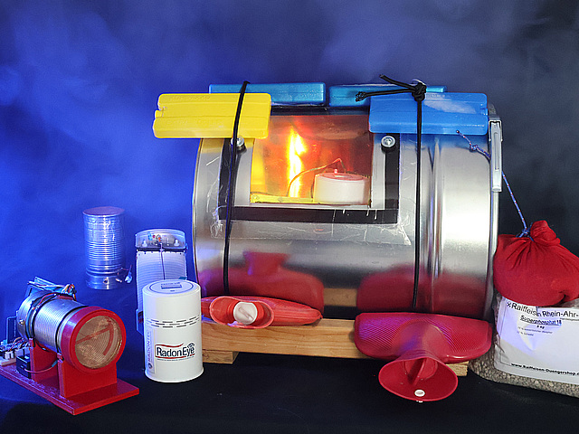

Maker Media GmbH

***

# Maßnahmen gegen Radonbelastung

Messungen mit der Ionenkammer oder das Ballonexperiment aus den letzten zwei
Make-Ausgaben haben Radon nachgewiesen? Keine Panik, wir erklären, wie sie die
Menge quantifizieren und bei gefährlichen Mengen das Radon aus dem Keller
entfernen können.

 

Den vollständigen Artikel gibt es in der Make 2/26.
